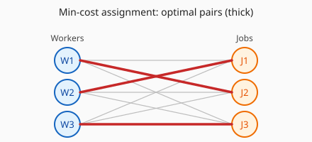

# 指派问题

指派问题是运筹学中常见的一类问题。可直观理解为：公司里有 $N$ 项待完成任务与 $N$ 名工人，每个工人都能做每一项任务，但完成效率各不相同；要求给每名工人恰好指派一项任务、每项任务恰由一名工人完成，使得总体效率（或总成本/总收益依建模而定）达到最优——典型为在一一配对下使总「效率」最大（或总成本最小）。

## 一、应用情境举例：网约出行

以网约出行平台（如 Uber、滴滴、Lyft 等）为例。在某一时段内，有 $N$ 名在线司机、$N$ 笔待接订单。记

- 司机的集合为 $D$，订单（乘客/需求）的集合为 $R$；
- 并设 $|D| = |R| = N$。

将乘客 $i \in R$ 与司机 $j \in D$ 进行匹配会产生代价 $c_{ij}$，例如以行程距离、接驾时间或综合成本来度量。问题是在上述一一配对的结构下，确定一种指派方案，使总距离（或总成本）最小；在其它建模下也可将目标换成平台收益等量的最大化，但指派结构相同。

## 二、0–1 决策变量

引入 0–1 决策变量 $x_{ij}$ 表示：乘客 $i$ 与司机 $j$ 之间是否被指派在一起。

$$
x_{ij} = \begin{cases} 1, & \text{如果乘客 } i \text{ 被分配给司机 } j \\[0.4em] 0, & \text{其他} \end{cases}
$$

## 三、数学模型：整数规划形式

在以上记号下，以最小化总代价为例，可将指派问题写成下述整数规划模型。式 (1) 为目标，式 (2) 表示每位乘客恰被指派一名司机，式 (3) 表示每位司机恰接一单，式 (4) 为 0–1 约束。

$$
\min \sum_{i \in R} \sum_{j \in D} c_{ij} x_{ij} \tag{1}
$$

$$
\text{s.t. } \sum_{j \in D} x_{ij} = 1, \quad \forall i \in R \tag{2}
$$

$$
\sum_{i \in R} x_{ij} = 1, \quad \forall j \in D \tag{3}
$$

$$
x_{ij} \in \{0, 1\}, \quad \forall i \in R,\; j \in D \tag{4}
$$

**注**：(2) 与 (3) 在两端各自「求和为 1」的约束，一起刻画了在 $|R|=|D|=N$ 时，可行解为两个集合间的一个完全匹配、即排列意义下的一一对应。

## 四、与二部图

指派问题在图论与组合优化中常视为一种特殊的二部图完美匹配问题：一侧顶点表示司机、另一侧表示订单（或一般的「人员」与「任务」），$c_{ij}$ 若在极小化模型中表示代价，则在每条边上可有对应的权重。

匈牙利算法的等价矩阵操作中常用「零元素」「在未变换图上选取互不相遇的一组独立零」等直观说法——它们在图上正是在某一快照的二部图中选取互不冲突的一组边（完全匹配）。本章末尾图解沿用记号：一侧人员（下文写法中用 $W_i$）、另一侧任务（$J_j$）可与前文 $|R|=|D|=N$ 对齐。

---

## 五、匈牙利算法（Hungarian algorithm）

极小化指派可用匈牙利算法（Kuhn–Munkres 族算法的等价矩阵叙述版本）。大意是对代价矩阵做不改变指派最优值的等价变换（各行各列加减常数），使尽可能多的位置上出现「可在可行性中用起来的」零；若当前等价矩阵上无法用互不重逢的一组独立零完成全盘指派（等价地说：盖住矩阵里全体零所需的最少横行条数加竖向条数少于 $N$），再按最小划线封面做一次等价调整后迭代。

同一指派最优结构若在图上解释为极小权和的完美匹配，则匈牙利算法的等价矩阵形式可与 König–Egévary 定理（二分图上最小顶点覆盖与最大匹配的对偶）及对偶变量直觉对齐；完整推导可参考任一运筹教材中对指派算法的章节。

**极大化**：若目标换成最大化 $\sum w_{ij} x_{ij}$，可令常数 $M \ge \max_{i,j} w_{ij}$，取等价极小代价矩阵 $c_{ij}' = M - w_{ij}$（或与书本等价的一组减法）；或对矩阵逐项乘以 $-1$ 后转成极小化再核对记号一致性。

::: algorithm 匈牙利算法（极小化指派；等价矩阵版）

### 1. 预处理与等价矩阵
从给定代价矩阵 $C=[c_{ij}]$ 出发构造等价矩阵 $C'$（初始可取 $C' \leftarrow C$）。

### 2. 行约简与列约简
$C'$ 的每一行减去该行的最小元（同一行的最小代价）；再在得到的矩阵上，每一列减去该列的最小元。此后矩阵元素全非负，且每行、每列至少有一个零。

### 3. 独立零与完备指派判定
只考虑当前 $C'$ 中值为零的位置，在这些位置上能否选出 $N$ 个两两不同行、不同列的「独立零」。若能，则把这些独立零对应的 $(i,j)$ 即定为最优指派（回到原始代价矩阵相加即得最优值）；若不能，进入步骤 4。

### 4. 最少划线盖住全体零
在当前 $C'$ 上，用数目最少的横行（整行覆盖）与竖向直线（整列覆盖）盖住矩阵中每一个零元素；记录划线总数 $\ell$。

### 5. 等价调整或返回匹配
若划线条数 $\ell < N$，令 $\delta$ 为未被任何划线覆盖的元素中之最小值：未被划线覆盖的每一行各元素减 $\delta$，被画了划线穿过的每一列各元素加 $\delta$，得到新的等价矩阵 $C'$，返回步骤 3。

若 $\ell = N$，返回步骤 3：在当前零结构上选取 $N$ 个独立零并得到指派（实践上与课本「划线恰为 $N$ 条」时的收尾一致）。

:::

步骤 4–5 可与课本中的「圈零」「划线封面」「打钩标记」等手绘记号对应；实现时常改用基于最短路的增广路径或更快数据结构，把总体复杂度做到 $O(n^3)$。

---

## 六、示例与图解（极小化）

考虑 $N=3$，代价矩阵（行为人 $W_i$，列为任务 $J_j$，均为原始代价）：

|      | $J_1$ | $J_2$ | $J_3$ |
|:----:|:-----:|:-----:|:-----:|
| $W_1$ |   9   |   2   |   7   |
| $W_2$ |   4   |   3   |   3   |
| $W_3$ |   5   |   8   |   2   |

行最小分别为 $2,3,2$，每行减去该行最小后：

|      | $J_1$ | $J_2$ | $J_3$ |
|:----:|:-----:|:-----:|:-----:|
| $W_1$ |   7   |   0   |   5   |
| $W_2$ |   1   |   0   |   0   |
| $W_3$ |   3   |   6   |   0   |

列最小分别为 $1,0,0$，再列约简得：

|      | $J_1$ | $J_2$ | $J_3$ |
|:----:|:-----:|:-----:|:-----:|
| $W_1$ |   6   |   0   |   5   |
| $W_2$ |   0   |   0   |   0   |
| $W_3$ |   2   |   6   |   0   |

此时可取独立零 $(W_1,J_2)$、$(W_2,J_1)$、$(W_3,J_3)$，已是完备指派；对应原矩阵代价和为 $c_{12}+c_{21}+c_{33}=2+4+2=8$，即为极小总代价。

下图在同一批记号下画出完全二部图（灰线为所有可能指派边）及上述最优指派对应的三条粗边（红）。

<figure>

<figcaption style="font-size:0.9em;color:#555;margin-top:0.3em">图：左侧 W1–W3 表示三名人员，右侧 J1–J3 表示三项任务；细灰线为全部可能配对，三条粗线为最优指派（与上表独立零一致）。图中标签为 ASCII，正文仍以数学下标 Wᵢ、Jⱼ 为准。</figcaption>
</figure>

具体工程应用与更大规模案例的展开可参见文献 Xu et al. (2018)。
