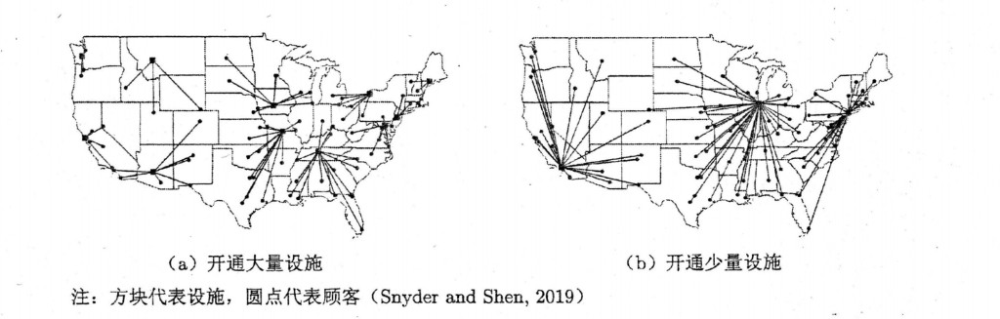

# 设施选址问题

**设施选址问题**（Facility Location Problem, FLP）是运筹优化中的一类重要模型：企业要在何处建设仓库、门店、分拨中心等设施、各设施服务哪些客户，往往属于长期战略决策。文献（如 Snyder and Shen, 2019）强调的核心权衡是：**在固定开设成本**（建维费用）**与服务可达性/运输成本**之间取得平衡。开设设施越多，通常客户离设施更近、服务水平更高，但固定支出越大；只开少量枢纽设施则省固定费，但客户平均距离变长、运输侧负担加重。下列示意（方格为设施、圆点为客户、连线为分配关系）在地图尺度上呈现了这一对比：图 2.17 左为多设施、右为少设施；图源为 Snyder and Shen (2019)。

<figure>

<figcaption style="font-size:0.9em;color:#555;margin-top:0.3em">左：开通大量设施；右：开通少量设施。方格为设施，圆点为客户；图源 Snyder and Shen (2019)。</figcaption>
</figure>

从决策结构看，大多数选址类问题同时包含两类相互耦合的决策：**在哪些候选点开设施**、**各客户由哪个（或哪些）已开设施服务**，因此也常合称**选址-分配问题**（location-allocation problem）。下面先给出**无容量限制**情形下的一个基准整数规划形式。

## 无容量限制的设施选址问题（UFLP）

**无容量限制的设施选址问题**（Uncapacitated Facility Location Problem, UFLP；亦常记为简单工厂选址/简单设施选址的整数规划形式）是 FLP 的基础版本：在候选点集合中决定开哪些设施，使全体客户需求被满足，并最小化**运输（或服务）成本与固定开设成本之和**。**只计固定费、在目标中让运输系数全为 0** 时，(1) 退化为以 $\min \sum_j f_j y_j$ 为主、在 (2)–(4) 仍须满足**覆盖/分配**结构的情形，与纯覆盖、集合覆盖等模型在文献中常对照讨论，但决策含义已不同于**含** $c_{ij}$ 的 UFLP。

设**候选设施**集合为 $N = \{1,2,\ldots,n\}$，**客户**集合为 $M = \{1,2,\ldots,m\}$。在设施 $j$ 开设的**固定费**为 $f_j$，由设施 $j$ 服务客户 $i$ 的**单位意义费用**为 $c_{ij}$。此处常将 $x_{ij}$ 解释为：客户 $i$ 的需求中由 $j$ 满足的比例，且各客户总需求在**归一化**后由 $\sum_{j} x_{ij}=1$ 表出。**决策变量**为：

- $y_j \in \{0,1\}$：是否在 $j$ 开设（$1$ 为开设）；
- $x_{ij}$：客户 $i$ 的需求中由 $j$ 满足的比例（连续变量；在最优时常在单设施指派结构下为 $0$ 或 $1$，依模型推广而定）。

UFLP 可写为：

$$
\min\; z = \sum_{i \in M} \sum_{j \in N} c_{ij} x_{ij} + \sum_{j \in N} f_j y_j \tag{1}
$$

$$
\text{s.t. } \sum_{j \in N} x_{ij} = 1, \quad \forall i \in M \tag{2}
$$

$$
x_{ij} \le y_j, \quad \forall i \in M,\; \forall j \in N \tag{3}
$$

$$
x_{ij} \ge 0,\;\; y_j \in \{0,1\}, \quad \forall i \in M,\; \forall j \in N \tag{4}
$$

（2）表示每个客户被完全分配；（3）为**开闭-分配联动**：只有已开设的 $j$ 才能承接正的 $x_{ij}$。若需求为一般正数 $d_i$，目标中常出现 $c_{ij} d_i x_{ij}$ 或将 (2) 写为流守恒形式，本页采用比例 $x_{ij}$ 的上述写法。

**注**：（1）–（4）是 UFLP 常见线性整数形式；部分写法将 (4) 中 $x$ 的域记为实矩阵、$y$ 为二元向量，与上式等价。

UFLP 是 NP-难的组合优化问题，实践中除分支定界、割平面与各类分解外，亦广泛使用启发式、元启发式与基于邻域的改进算法；**带容量、随机需求、多阶段动态选址**等扩展在应用文献中极多，可视为在 (1)–(4) 上增加线性与整数约束或随机参数。
