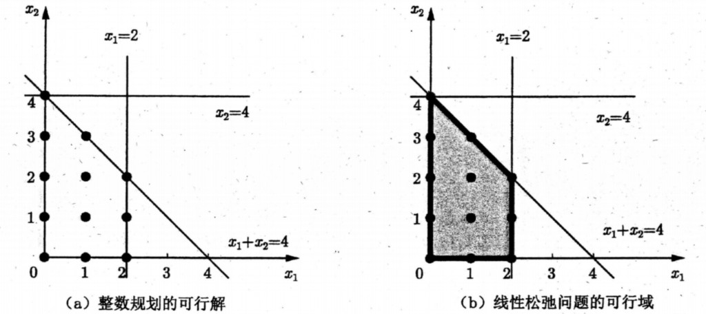

# 最优整数解特性与幺模矩阵

**注**：本页显式式号自 (1) 起、仅本页内连续；与教材第 2 章式 (2.39)–(2.42) 等互查时以原书为准。

最短路、指派等模型常具有整数最优解特性：其线性松弛模型的最优解本身就是整数向量，因而与对应整数规划的最优解一致。下面先借一个二维小例子与图 2.12 说明该性质在几何上意味着什么；再给出幺模（教材中亦印作「么模」，与英文 *unimodular* 同指）与全幺模矩阵的定义及常用判定思路。可参见陈景良、陈向晖 (2010)、Shapiro (1979) 等线性规划与整数规划教材中的系统论述。

## 2.4.3 最优整数解特性的理解

考虑一个仅含两个决策变量的整数规划，及其去掉整数约束后的线性松弛。

$$
\begin{aligned}
\max \quad & z = 2x_1 + x_2 \\
\text{s.t.} \quad & x_1 + x_2 \le 4 \\
& x_1 \le 2 \\
& x_2 \le 4 \\
& x_1, x_2 \in \mathbb{Z}
\end{aligned}
\tag{1}
$$

$$
\begin{aligned}
\max \quad & z = 2x_1 + x_2 \\
\text{s.t.} \quad & x_1 + x_2 \le 4 \\
& x_1 \le 2 \\
& x_2 \le 4 \\
& x_1, x_2 \ge 0
\end{aligned}
\tag{2}
$$

将 (1) 的全部可行整数点画在 $x_1$–$x_2$ 平面上（图 2.12(a)），再观察这些点张成的凸包与 (2) 的可行域（图 2.12(b)）：二者完全重合。由此可见：

- 线性规划的最优解若取在可行域的极点（顶点）上，而该可行域的极点又全部是 (1) 的可行整数点，则松弛问题与整数规划共享同一组「角点最优」结构。  
- 一般地，若某整数规划所有可行解的凸包恰等于其线性松弛的可行域，则松弛最优解必为整数最优解。

<figure>

<figcaption style="font-size:0.88em;color:#555;margin-top:0.35em">图 2.12（与教材同图）：(a) 整数规划可行解（黑点）；(b) 线性松弛可行域，与 (a) 中可行整数点的凸包一致。原书第 2 章中对应模型记为式 (2.39)、(2.40)。</figcaption>
</figure>

## 2.4.4 幺模矩阵和整数最优解特性

要判断一般整数规划的约束矩阵是否带来「松弛解必为整数」等性质，需借助矩阵的整数性与幺模性。

### 定义 2.4.1（整数矩阵）

若矩阵 $A \in \mathbb{R}^{m \times n}$ 的每个元素均为整数，则称 $A$ 为整数矩阵。

### 定义 2.4.2（幺模矩阵）

设 $A \in \mathbb{R}^{m \times n}$ 为整数矩阵，$r = \mathrm{rank}\, A = \min\{m,n\}$。若 $A$ 的每一个非奇异 $r \times r$ 子式（子行列式）的取值均为 $1$ 或 $-1$，则称 $A$ 为幺模矩阵（*unimodular matrix*）。特别地，当 $m = n$ 时，整数方阵 $A$ 幺模当且仅当 $\det A \in \{1, -1\}$。

### 定义 2.4.3（全幺模矩阵）

若 $A$ 为幺模矩阵，且 $A$ 的各阶子式取值均属于 $\{0, 1, -1\}$，则称 $A$ 为全幺模矩阵（*totally unimodular matrix*，常缩写为 TU）。

由定义可直接得到：全幺模矩阵的每个元素必属于 $\{0, 1, -1\}$；两个 $n \times n$ 幺模矩阵的乘积仍是幺模矩阵（在教材中作为常用结论列出）。

### 定理 2.4.1

设 $m \le n$。对任意整数向量 $b$，方程组

$$
A x = b \tag{3}
$$

的所有基本解都是整数向量的充要条件是：$A$ 为幺模矩阵。

### 定理 2.4.2

设 $A \in \mathbb{R}^{m \times n}$ 为整数矩阵。若对任意整数向量 $b$，不等式组

$$
A x \le b \tag{4}
$$

的所有基本解都是整数向量，则 $A$ 必为全幺模矩阵。

### 定理 2.4.3（保持全幺模的运算）

设 $A = [b_{ij}] \in \mathbb{R}^{m \times n}$ 为全幺模矩阵，则对 $A$ 作下列任一操作后，仍得全幺模矩阵：

1. 交换两行或两列；  
2. 转置；  
3. 将某行或某列乘以 $-1$；  
4. 追加一行或一列，其中恰有一个非零元，且该非零元为 $1$ 或 $-1$。

**注**：上述结论刻画了：在 $A$ 满足适当结构时，$A x = b$ 或 $A x \le b$ 所对应线性规划（在标准形或松弛形式下）的基解、极点向量为整数，从而与整数约束相容；与 [最短路问题](shortest-path-problem.md)、[最大流问题](max-flow-problem.md) 等网络模型中常见的整数性现象可对照阅读。定义与定理编号与教材 2.4.4 节各条对齐，便于与印刷本互查。
