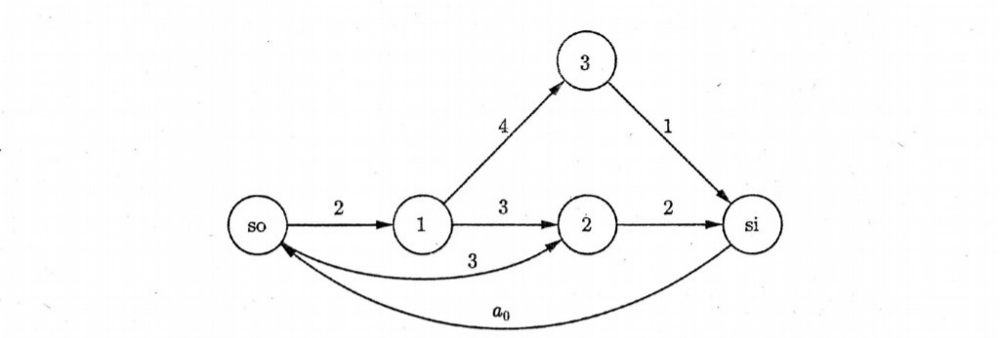
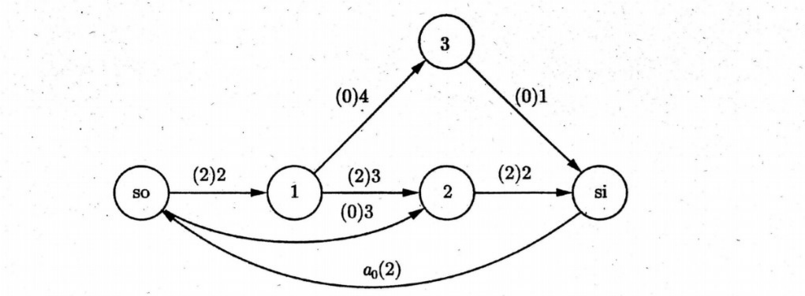

# 最大流问题

**注**：本页显式式号自 (1) 起、仅本页内连续；与教材第 2 章式 (2.12)–(2.29) 互查时以原书为准。

很多生产、物流类场景都可以建成弧上带流量上界的网络：在源点有供应、在汇点有需求或接收，希望在满足弧容量与平衡条件的前提下，从源到汇输送尽可能多的流量。这就是经典的最大流问题（Maximum Flow Problem, MFP）。

## 2.3.1 问题描述

下面借助油气输送的例子说明，如何把具体情景写成线性规划；叙述与数表可参见教材（如 Winston and Goldberg, 2004 等）中的同类写法。

某油气加工公司需进行油料输送。输送网络为带源点 $\mathrm{so}$ 与汇点 $\mathrm{si}$ 的管道网络（见下图 2.4）。油料从源到汇中途径中间站点 $1$、$2$、$3$。不同管段因管径等差异具有不同最大通过能力；表 2.1 给出各有向弧的容量，单位为百万桶/小时。希望建立线性规划模型，求该网络在例如「每小时能输送几百万桶」意义下的最大通过能力。

表 2.1 石油运输问题的弧容量（百万桶/时）

| 弧 | 容量 |
|:--:|:--:|
| $(\mathrm{so},1)$ | 2 |
| $(\mathrm{so},2)$ | 3 |
| $(1,2)$ | 3 |
| $(1,3)$ | 4 |
| $(3,\mathrm{si})$ | 1 |
| $(2,\mathrm{si})$ | 2 |

<figure>

<figcaption style="font-size:0.9em;color:#555;margin-top:0.3em">图 2.4（与教材同图）。弧上为容量；底部 si→so 的回流在模型里用 $x_0$（或记 $a_0$）与人工弧配合实现平衡。见 2.3.2。</figcaption>
</figure>

## 2.3.2 问题建模及最优解

为便于在各节点上写出「入流 = 出流」的平衡式，常采用一种技巧：在汇点 $\mathrm{si}$ 到源点 $\mathrm{so}$ 之间人工添加一条有向弧（教材中自汇向源，记法与 $(\mathrm{si},\mathrm{so})$ 一致；有的书写为辅助弧）。设该人工弧上的流量为 $x_0$（图 2.4 中有时把待最大化的总流量标注在回流弧上为 $a_0$，与 $x_0$ 在含义上对应同一流量值）。该弧并不对应真实管输，只用于在模型中把净流量统一写成闭网络形式。

设 $x_{ij}$ 为弧 $(i,j)$ 上每小时通过的流量（百万桶）。在教材给出的一个可行解或最优解（可对照图 2.5）中，有

- $x_{\mathrm{so},1} = 2,\quad x_{\mathrm{so},2} = 0$  
- $x_{12} = 2,\quad x_{13} = 0$  
- $x_{3,\mathrm{si}} = 0,\quad x_{2,\mathrm{si}} = 2$  
- 人工/回流方向取 $x_{\mathrm{si},\mathrm{so}} = 2$（与 $x_0$ 同值，表示网络总流量为 2）  

此配置下，网络最大流量为 2（百万桶/时）。

<figure>

<figcaption style="font-size:0.9em;color:#555;margin-top:0.3em">图 2.5（与教材同图）。弧上为流量与容量标注。与上段给出一组可行解、总流 2 一致。教材中 1 与 2 之间若画双线表示平行弧，以对应不同流量分解。</figcaption>
</figure>

**注**：一般情形的弧与节点平衡见下两节；教材《运筹优化常用模型、算法及案例实战：Python+Java 实现》第 14 页附近给出下述 (1)–(15) 对应内容的线性规划形式（原书式 (2.12)–(2.26)）。

### 一般约束形式

可行流需满足容量与流平衡：

$$
0 \le x_{ij} \le \text{弧 } (i, j) \text{ 的容量}, \quad \forall (i, j) \tag{1}
$$

$$
\text{流入点 } i \text{ 的流量} = \text{流出点 } i \text{ 的流量}, \quad \forall i \tag{2}
$$

将人工弧 $(\mathrm{si},\mathrm{so})$ 及其流量 $x_0$ 显式放入模型，则极大化 $x_0$ 就等价于极大化从 $\mathrm{so}$ 到 $\mathrm{si}$ 的可行输送量。对本例，得到如下 LP（$z=x_0$ 为目标）。

$$
\max \quad z = x_0 \tag{3}
$$

弧容量（与表 2.1 一致）：

$$
\begin{aligned}
& x_{\mathrm{so},1} \le 2 \tag{4} \\
& x_{\mathrm{so},2} \le 3 \tag{5} \\
& x_{12} \le 3 \tag{6} \\
& x_{2,\mathrm{si}} \le 2 \tag{7} \\
& x_{13} \le 4 \tag{8} \\
& x_{3,\mathrm{si}} \le 1 \tag{9}
\end{aligned}
$$

流量平衡（本网络拓扑）：

$$
\begin{aligned}
& x_0 = x_{\mathrm{so},1} + x_{\mathrm{so},2} \tag{10} \\
& x_{\mathrm{so},1} = x_{12} + x_{13} \tag{11} \\
& x_{\mathrm{so},2} + x_{12} = x_{2,\mathrm{si}} \tag{12} \\
& x_{13} = x_{3,\mathrm{si}} \tag{13} \\
& x_{3,\mathrm{si}} + x_{2,\mathrm{si}} = x_0 \tag{14}
\end{aligned}
$$

$$
x_{ij} \ge 0, \quad \text{对图中出现的弧 } (i,j) \tag{15}
$$

**注**：(4)–(9) 为弧上容量；(10)–(14) 为在添加人工弧后的节点平衡；模型搭好后可用任意 LP 软件求解。上一段给出的数值解使 $x_0=2$，与「最大 2 百万桶/时」一致（原书式 (2.15)–(2.25)）。

## 2.3.3 最大流问题的一般模型

设有向图 $G = (V, E)$，$V$ 为顶点、$E$ 为边集。对每条有向边 $(i,j) \in E$ 有上界容量 $u_{ij}$。设 $\mathrm{so}$ 为源、$\mathrm{si}$ 为汇。在一般叙述中，用

- 决策变量 $x_e$ 表示在边 $e$ 上的流量；  
- 标量 $f$ 表示从 $\mathrm{so}$ 到 $\mathrm{si}$ 的总流量（即最大流问题要最大化的量）。

在流守恒表述下，可写为

$$
\max \quad f \tag{16}
$$

$$
\sum_{e \in \text{Out}(i)} x_e - \sum_{e \in \text{In}(i)} x_e = b_i, \quad \forall i \in V \tag{17}
$$

$$
0 \le x_e \le u_{ij}, \quad \forall e = (i,j) \in E \tag{18}
$$

其中 $b_i$ 的取值为：$i = \mathrm{so}$ 时 $b_i = f$；$i = \mathrm{si}$ 时 $b_i = -f$；其余中间节点上 $b_i = 0$。若采用与 2.3.2 相同的人工回流弧技巧，把 $f$ 与某条 $x_0$ 或等价标量对应起来，则一般模型与具体 LP 实现可一一对应。

**注**：(17) 中 $\text{Out}(i)$、$\text{In}(i)$ 分别表示离开、进入 $i$ 的弧的集合，与[最短路问题](shortest-path-problem.md) 中的 $\text{out}/\text{in}$ 写法同型，仅记法在教材中可能大小写不统一；原书式 (2.28)。最大流是网络流与组合优化的核心模型之一，可用专门算法或 LP/ILP 求解器计算。
