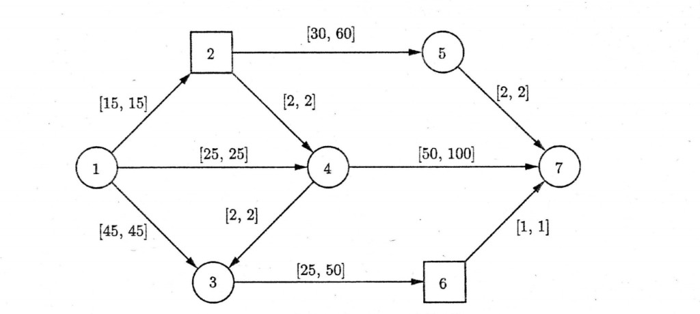

# 多商品网络流问题

多商品网络流问题（Multicommodity Network Flow, MCNF，亦常称多物网络流问题）指：多种商品各自从若干发点经同一网络中共用的弧流往各自的收点，在弧上容量等约束下决定各商品、各弧上的流量，使总成本（或所建模目标）最优。在服务网络设计、通信网络、物流网络设计等生产与工程场景中应用很广。

当供应点集合与客户点集合可视为二部划分、每类商品只在「供应方–客户方」的弧上起讫、不经中间转点时，MCNF 在结构上会退化为 [多商品流运输问题](multicommodity-transportation.md)（MCTP）：弧集为 $A \subseteq S \times C$，平衡约束按发点与收点侧分别写出。

在下列形式下给出一种常见定义。给定有向图 $G = (V, A)$，$V$ 为节点、$A$ 为弧集，并给定如下参数（记号在文献中常见，可据题设增删有向/无向、成本结构等）：

- $K$：商品流集合，共 $|K|$ 类「流」；可对应 $|K|$ 组起讫-需求量三元组 $(s_k, t_k, d_k)$，$k$ 在 $K$ 中取值。  
- $d_k$：商品 $k \in K$ 的需求：需从 $s_k$ 向 $t_k$ 输送的物资量。  
- $u_{ij}$：弧 $(i, j) \in A$ 的容量；所有商品在该弧上流量之和不得超过 $u_{ij}$。  
- $c_{ij}^k$：在弧 $(i, j) \in A$ 上输送商品 $k$ 的单位费用。

MCNF 的决策含义是：为每一类商品设计可行路径/流量，使其从发点以需求量到达各自收点、满足上界等约束，并使产生的总成本最小。

**注**：为直观展示，可参见文献 Cappanera and Scaparra, 2011 中的示例网络；示例网络见下图 2.13。文中另有两类商品数值例：商品 1 为 $[1,7,25]$（自节点 1 至 7、需求 25），商品 2 为 $[2,6,2]$。另有文献在图中给出总成本 1873 的**数值**可行解，本页不附其图 2.14 一面的复制品；**弧上**费用、容量**及** (1)–(4) 中变量含义已在上文**写全**，无需求图即可建立完整模型。下图中成对方括号在常见记法中表示费用、容量等参数对，**仅**保留**拓扑**作示意。

<figure>

<figcaption style="font-size:0.9em;color:#555;margin-top:0.3em">图 2.13：7 节点示例有向网；方弧与圆点区分可对照 Cappanera and Scaparra 类文献。弧标为成对方括号，常对应弧上费用、容量等参数对。</figcaption>
</figure>

## 线性规划形式

设 $x_{ij}^k$ 为商品 $k$ 在弧 $(i, j)$ 上的流量。MCNF 常写为下述线性模型。

目标为最小化总费用：

$$
\min \sum_{(i,j) \in A} \sum_{k \in K} c_{ij}^k x_{ij}^k \tag{1}
$$

流量守恒（对每一节点 $i$、每一商品 $k$）：以「流出减流入」等于发、收、中转平衡量；其中对 $(i,j) \in A$ 有向求和。下式在 $i = s_k$ 处为发量 $d_k$，在 $i = t_k$ 处为 $-d_k$，其余为 0（同一 $i$ 可对多对 $(s_k,t_k)$ 分别成式，以题设为准）。

$$
\sum_{j: (i,j) \in A} x_{ij}^k - \sum_{j: (j,i) \in A} x_{ji}^k = \begin{cases}
d_k, & i = s_k,\; k \in K \\[0.35em]
-d_k, & i = t_k,\; k \in K \\[0.35em]
0, & i \in V \setminus \{s_k, t_k\},\; k \in K
\end{cases} \tag{2}
$$

弧容量（多商品共用一弧的容量上界）：

$$
\sum_{k \in K} x_{ij}^k \le u_{ij}, \quad \forall (i,j) \in A \tag{3}
$$

非负：

$$
x_{ij}^k \ge 0, \quad \forall (i,j) \in A,\; k \in K \tag{4}
$$

**注**：上列 (1)–(4) 是 MCNF 线性格式的常见写法的完整一组；当图无平行弧、或 $s_k,t_k$ 不重合时，守恒式常按「每一 $(k)$ 与每一 $i$ 一行」在实现中显式展开。多商品使问题规模与结构显著难于单商品最大流/最短路，常用分解、列生成、近似或启发式等求解；属网络优化与组合优化的经典难型之一。
