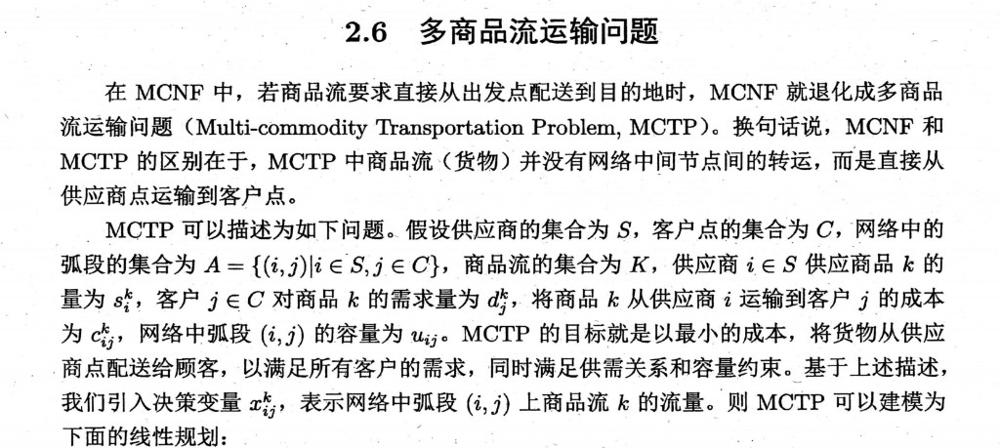
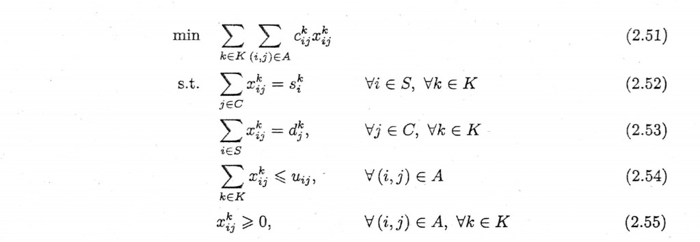
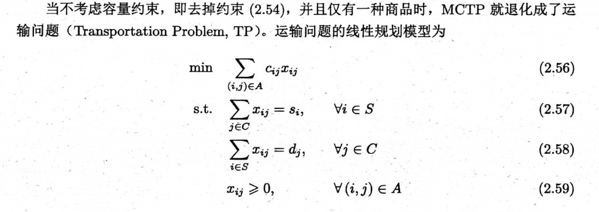

# 多商品流运输问题

在 [多商品网络流](multicommodity-network-flow.md)（MCNF）中，若每一类商品都**要求**从发点**直接**配送到收点、不经中间节点转运，则 MCNF 在结构上退化为**多商品流运输问题**（Multi-commodity Transportation Problem，MCTP）。换言之：MCNF 与 MCTP 的差异在于，MCTP 中各类货物不在网络中间节点之间做一般意义上的「中转」，而是由**供应点**直接运向**客户点**，弧集常取为二部结构 $S \times C$ 上的边。

<figure>

<figcaption style="font-size:0.9em;color:#555;margin-top:0.3em">教材节录：MCTP 与 MCNF 的关系及集合、参数、决策变量定义（与打印版一致）。</figcaption>
</figure>

设供应商集合为 $S$，客户集合为 $C$，弧集为

$$
A = \{(i,j) \mid i \in S,\; j \in C\},
$$

商品集合为 $K$。记：供应商 $i \in S$ 对商品 $k$ 的供应量为 $s_i^k$，客户 $j \in C$ 对商品 $k$ 的需求量为 $d_j^k$，将商品 $k$ 从 $i$ 运到 $j$ 的单位成本为 $c_{ij}^k$，弧 $(i,j)$ 的容量为 $u_{ij}$。决策变量 $x_{ij}^k$ 表示弧 $(i,j)$ 上商品 $k$ 的流量。MCTP 的目标是在满足供需与容量前提下，以最小总成本完成配送。

## MCTP 的线性规划形式

$$
\min \sum_{k \in K} \sum_{(i,j) \in A} c_{ij}^k x_{ij}^k \tag{1}
$$

$$
\text{s.t. } \sum_{j \in C} x_{ij}^k = s_i^k, \quad \forall i \in S,\; \forall k \in K \tag{2}
$$

$$
\sum_{i \in S} x_{ij}^k = d_j^k, \quad \forall j \in C,\; \forall k \in K \tag{3}
$$

$$
\sum_{k \in K} x_{ij}^k \le u_{ij}, \quad \forall (i,j) \in A \tag{4}
$$

$$
x_{ij}^k \ge 0, \quad \forall (i,j) \in A,\; \forall k \in K \tag{5}
$$

**注**：(1)–(5) 与教材式 (2.51)–(2.55) 同型；(2)(3) 为按供应点、按客户点的供需平衡，(4) 为弧上多商品合计容量。

<figure>

<figcaption style="font-size:0.9em;color:#555;margin-top:0.3em">教材影印：目标与约束 (2.51)–(2.55)，可与上文 (1)–(5) 对照。</figcaption>
</figure>

## 退化为运输问题（TP）

若不考虑容量约束（相当于去掉 (4)  / 原书 (2.54)），且全网络**只有一种**商品，则 MCTP 退化为经典的**运输问题**（Transportation Problem，TP）。其线性规划常写为

$$
\min \sum_{(i,j) \in A} c_{ij} x_{ij} \tag{6}
$$

$$
\text{s.t. } \sum_{j \in C} x_{ij} = s_i, \quad \forall i \in S \tag{7}
$$

$$
\sum_{i \in S} x_{ij} = d_j, \quad \forall j \in C \tag{8}
$$

$$
x_{ij} \ge 0, \quad \forall (i,j) \in A \tag{9}
$$

其中 $x_{ij}$ 为单商品在弧 $(i,j)$ 上的运量，$c_{ij}$ 为单位成本，$s_i$、$d_j$ 为发、收量（与总平衡、可行情形等经典讨论见运筹教材）。

**注**：(6)–(9) 与教材式 (2.56)–(2.59) 同型。

<figure>

<figcaption style="font-size:0.9em;color:#555;margin-top:0.3em">教材影印：由 MCTP 到 TP 的文字与式 (2.56)–(2.59)。</figcaption>
</figure>
