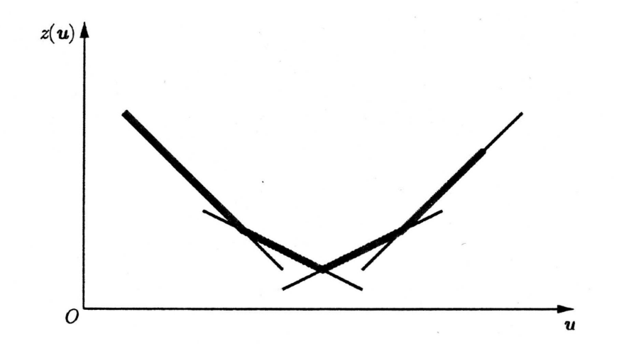

# 拉格朗日松弛

拉格朗日（拉格朗日）松弛 / 对偶是整数规划、组合优化中常用的一种分解与定界技术：将一批“难”约束对偶化到目标里，在保留的“易”可行集上求子问题，并通过对乘子 $\mathbf{u}$ 的优化得到对原问题目标值的界。全文记号自成体系（(IP)、$\mathrm{IP}(\mathbf{u})$、拉格朗日对偶 (LD) 等）；公式旁编号 (12.x) 等仅便于本文内交叉指代。若需与经典专著对照，可参见 Wolsey (1998) 等。

---

## 1. 拉格朗日松弛介绍

### 1.1 原问题：易约束与难约束

考虑整数规划原问题。若把约束区分为相对容易与困难的两部分，可写为（极大化原问题，便于后文叙述）：

$$
\begin{aligned}
z = \max \quad & \mathbf{c}^\top \mathbf{x} \\
\text{s.t.} \quad & A\mathbf{x} \le \mathbf{b}, \\
& D\mathbf{x} \le \mathbf{d}, \\
& \mathbf{x} \in \mathbb{Z}_+^n.
\end{aligned}
$$

- 若只保留 $A\mathbf{x} \le \mathbf{b}$ 与非负整数，问题往往容易（结构简单、可分解、或便于求解）。
- 一旦加入 $D\mathbf{x} \le \mathbf{d}$，问题可能变得极难（如 TSP 中大量子圈消除约束）。

若直接删去难约束 $D\mathbf{x} \le \mathbf{d}$，可行域过大，上界/下界很松，缺少对“违反难约束的惩罚”。

### 1.2 用可行集 $X$ 写成的等价形式

令

$$
X = \left\{ \mathbf{x} : A\mathbf{x} \le \mathbf{b},\; \mathbf{x} \in \mathbb{Z}_+^n \right\},
$$

并设 $D\mathbf{x} \le \mathbf{d}$ 为 $m$ 条相对复杂的约束。则原问题可写为：

$$
\begin{aligned}
z = \max \quad & \mathbf{c}^\top \mathbf{x} \\
\text{s.t.} \quad & D\mathbf{x} \le \mathbf{d}, \\
& \mathbf{x} \in X.
\end{aligned}
$$

### 1.3 拉格朗日松弛问题 $\mathrm{IP}(\mathbf{u})$

对任意非负乘子向量 $\mathbf{u} = (u_1, \ldots, u_m)^\top$（$u_i \ge 0$），将 $D\mathbf{x} \le \mathbf{d}$ 以惩罚项形式并入目标，得到拉格朗日松弛子问题：

$$
\begin{aligned}
z(\mathbf{u}) = \max \quad & \mathbf{c}^\top \mathbf{x} + \mathbf{u}^\top(\mathbf{d} - D\mathbf{x}) \\
\text{s.t.} \quad & \mathbf{x} \in X.
\end{aligned}
$$

记为 $\mathrm{IP}(\mathbf{u})$，其中 $z(\mathbf{u})$ 为在乘子 $\mathbf{u}$ 下该子问题的最优值。直观上，$\mathbf{d} - D\mathbf{x}$ 衡量“难约束的松弛量”：在可行时该项非负，乘上 $\mathbf{u}$ 对目标产生奖罚；$\mathbf{u}$ 常被解释为影子价格 / 对偶变量 / 拉格朗日乘子（依上下文）。

---

## 2. 松弛性质与上界

### 2.1 拉格朗日松弛的定界

定理：对任意 $\mathbf{u} \ge \mathbf{0}$，问题 $\mathrm{IP}(\mathbf{u})$ 是原问题 (IP) 的松弛（relaxation）。

证明（满足松弛的两项常见条件）：

1. 可行域  
   原 (IP) 的可行解满足 $\mathbf{x} \in X$ 且 $D\mathbf{x} \le \mathbf{d}$，即位于 $\{ \mathbf{x} \in X : D\mathbf{x} \le \mathbf{d}\}$。而 $\mathrm{IP}(\mathbf{u})$ 仅要求 $\mathbf{x} \in X$，不再显式要求 $D\mathbf{x} \le \mathbf{d}$，故在 $\mathbf{x}$ 的取值范围上，松弛问题的可行域是原可行域的超集（或理解为：先放宽难约束、再以罚项在目标中体现）。

2. 目标值比较（对 (IP) 的任一可行解 $\mathbf{x}$）  
   因 $\mathbf{u} \ge \mathbf{0}$ 且 $D\mathbf{x} \le \mathbf{d}$，有 $\mathbf{d} - D\mathbf{x} \ge \mathbf{0}$，故

   $$
   \mathbf{c}^\top \mathbf{x} + \mathbf{u}^\top(\mathbf{d} - D\mathbf{x}) \ge \mathbf{c}^\top \mathbf{x}.
   $$

   即在同一 $\mathbf{x}$ 上，松弛问题的目标不低于原目标。

推论（定界，极大化原问题）：对任意 $\mathbf{u} \ge \mathbf{0}$，$\mathrm{IP}(\mathbf{u})$ 的最优值 $z(\mathbf{u})$ 给原 (IP) 的最优值 $z$ 一个上界：

$$
z(\mathbf{u}) \ge z.
$$

为了得到尽量紧的上界，自然希望在 $\mathbf{u} \ge \mathbf{0}$ 上最小化 $z(\mathbf{u})$。这就引出下一节的拉格朗日对偶。

---

## 3. 拉格朗日对偶问题

### 3.1 对偶 (LD) 的写法

为求“最好的”乘子，定义拉格朗日对偶问题：

$$
(LD) \qquad w_{LD} = \min \left\{ z(\mathbf{u}) : \mathbf{u} \ge \mathbf{0} \right\}.
$$

等式难约束的情形：若难约束在模型中写为 $D\mathbf{x} = \mathbf{d}$，则乘子不再限制符号，$\mathbf{u} \in \mathbb{R}^m$，对偶为

$$
w_{LD} = \min_{\mathbf{u} \in \mathbb{R}^m} z(\mathbf{u}).
$$

在一定条件下，求解 (LD) 可得到紧的上界，个别情形下还可由此恢复原 (IP) 的最优解（见下述最优性条件）。

### 3.2 最优性条件：何时 $\mathrm{IP}(\mathbf{u})$ 的解就是 (IP) 的解

设 $\mathbf{u} \ge \mathbf{0}$，并存在 $\mathbf{x}(\mathbf{u})$ 满足：

1. $\mathbf{x}(\mathbf{u})$ 是 $\mathrm{IP}(\mathbf{u})$ 的最优解；
2. $D\mathbf{x}(\mathbf{u}) \le \mathbf{d}$（原难约束可行）；
3. 互补松弛：对所有 $i$，若 $u_i > 0$ 则 $[D\mathbf{x}(\mathbf{u})]_i = d_i$。

则 $\mathbf{x}(\mathbf{u})$ 是原 (IP) 的最优解。

证明思路（要点）：由 (1) 有

$$
w_{LD} \le z(\mathbf{u})
= \mathbf{c}^\top \mathbf{x}(\mathbf{u}) + \mathbf{u}^\top(\mathbf{d} - D\mathbf{x}(\mathbf{u})).
$$

由 (3) 得 $\mathbf{u}^\top(\mathbf{d} - D\mathbf{x}(\mathbf{u})) = 0$，故

$$
z(\mathbf{u}) = \mathbf{c}^\top \mathbf{x}(\mathbf{u}).
$$

由 (2) 得 $\mathbf{x}(\mathbf{u})$ 对 (IP) 可行，故 $\mathbf{c}^\top \mathbf{x}(\mathbf{u}) \le z$。结合弱对偶/对偶界有 $w_{LD} \ge z$，在适当条件下可推出 $w_{LD} = z$ 与最优性。

注：难约束全部为等式时 (3) 常自动更自然；若某 $\mathrm{IP}(\mathbf{u})$ 的最优解已经满足 (IP) 的全体约束，它往往也是 (IP) 的最优解之一。

---

## 4. 应用：无容量设施选址 (UFLP) 的拉格朗日松弛

### 4.1 集合、参数与变量

- $N = \{1,\ldots,n\}$：潜在设施下标；$M = \{1,\ldots,m\}$：客户下标。  
- $f_j$：开放设施 $j$ 的固定费用；$c_{ij}$：将客户 $i$ 全部分配到 $j$ 时产生的收益（也可理解为“净收益”，即已扣除相应成本后的量，视建模习惯而定）。  
- 决策：$y_j \in \{0,1\}$ 是否开设施 $j$；$x_{ij} \in [0,1]$ 为客户 $i$ 由 $j$ 满足的需求比例；需求约束 $\sum_{j} x_{ij} = 1$ 保证每个客户恰好被完全满足（无容量时可用比例 $1$ 全分给某一设施等解释）。

原 (IP)：

$$
\begin{aligned}
\text{(IP)} \qquad
\max z =\ {} & \sum_{i \in M} \sum_{j \in N} c_{ij} x_{ij} - \sum_{j \in N} f_j y_j
& (12.2) \\[0.3em]
\text{s.t.} \quad & \sum_{j \in N} x_{ij} = 1, & \forall i \in M & \quad (12.3) \\
& x_{ij} \le y_j, & \forall i \in M,\, j \in N & \quad (12.4) \\
& \mathbf{x} \in \mathbb{R}_+^{|M| \times |N|}, \; \mathbf{y} \in \{0,1\}^{|N|}. & & (12.5)
\end{aligned}
$$

### 4.2 松弛 (12.3)：$\mathrm{IP}(\mathbf{u})$

对每条需求约束引入乘子 $u_i$，将 (12.3) 对偶到目标。目标中增加

$$
\sum_{i \in M} u_i \left( 1 - \sum_{j \in N} x_{ij} \right),
$$

整理得等价目标为（相当于将 (12.3) 的罚项展开后合并同类项）：

$$
\sum_{i \in M} \sum_{j \in N} (c_{ij} - u_i) x_{ij} - \sum_{j \in N} f_j y_j + \sum_{i \in M} u_i.
$$

拉格朗日松弛（保留 (12.4)(12.5)）为：

$$
\begin{aligned}
\mathrm{IP}(\mathbf{u}) \qquad
\max z(\mathbf{u}) =\ {} & \sum_{i \in M} \sum_{j \in N} (c_{ij} - u_i) x_{ij} - \sum_{j \in N} f_j y_j + \sum_{i \in M} u_i
& (12.8) \\[0.2em]
\text{s.t.} \quad & x_{ij} \le y_j, & \forall i \in M,\, j \in N & \quad (12.9) \\
& \mathbf{x} \ge \mathbf{0},\; \mathbf{y} \in \{0,1\}^{|N|}. & & (12.10)
\end{aligned}
$$

### 4.3 按设施 $j$ 分解

(12.9) 按 $(i,j)$ 可分离为每个 $j$ 一个子问题。总目标

$$
z(\mathbf{u}) = \sum_{j \in N} z_j(\mathbf{u}) + \sum_{i \in M} u_i,
$$

其中

$$
\begin{aligned}
\mathrm{IP}(\mathbf{u})_j: \qquad
z_j(\mathbf{u}) = \max \quad & \sum_{i \in M} (c_{ij} - u_i) x_{ij} - f_j y_j
& (12.11) \\[0.2em]
\text{s.t.} \quad & x_{ij} - y_j \le 0, & \forall i \in M & \quad (12.12) \\
& x_{ij} \ge 0,\; y_j \in \{0,1\}, & \forall i \in M. & (12.13)
\end{aligned}
$$

闭式解（对固定的 $j$）：

- 若 $y_j = 0$，则 $x_{ij} = 0$，目标为 $0$。  
- 若 $y_j = 1$，为最大化，在 $x_{ij} \in [0,1]$ 且 $x_{ij} \le y_j=1$ 下，可对每个 $i$ 独立将 $x_{ij}$ 取到使 $(c_{ij}-u_i)x_{ij}$ 最大的 $0$ 或 $1$。在“若开设施 $j$，则对客户 $i$ 要么全给 $j$、要么不给”的{0,1} 指派解释下，得到

$$
z_j(\mathbf{u})
= \max \left\{
0,\; \sum_{i \in M} \max\bigl\{ c_{ij} - u_i,\, 0 \bigr\} - f_j
\right\}.
$$

（若仍允许 $x_{ij}$ 为 $[0,1]$ 上的连续分配，闭式需按该子问题结构另写；上式对应二元指派型 UFLP 子问题常见闭式。）

---

## 5. 数值算例

取 $m = 6$ 个客户、$n = 5$ 个设施。

固定费（本例取下列数值，便于手算）：

$$
\mathbf{f}^\top = (2,\; 4,\; 5,\; 3,\; 3).
$$

收益矩阵 $\{c_{ij}\}$（$6 \times 5$）：

$$
\begin{bmatrix}
6 & 2 & 1 & 3 & 5 \\
4 & 10 & 2 & 6 & 1 \\
3 & 2 & 4 & 1 & 3 \\
2 & 0 & 4 & 1 & 4 \\
1 & 8 & 6 & 2 & 5 \\
3 & 2 & 4 & 8 & 1
\end{bmatrix}
$$

给定一组乘子 $\mathbf{u}^\top = (5, 6, 3, 2, 5, 4)$，则

$$
\sum_{i \in M} u_i = 25.
$$

有效收益 $c_{ij} - u_i$ 的矩阵为：

$$
\begin{bmatrix}
1 & -3 & -4 & -2 & 0 \\
-2 & 4 & -4 & 0 & -5 \\
0 & -1 & 1 & -2 & 0 \\
0 & -2 & 2 & -1 & 2 \\
-4 & 3 & 1 & -3 & 0 \\
-1 & -2 & 0 & 4 & -3
\end{bmatrix}
$$

设施 $j = 2$ 为例：第 2 列 $(-3, 4, -1, -2, 3, -2)^\top$ 中正分量为第 $2$ 行的 $4$ 与第 $5$ 行的 $3$。若 $y_2 = 1$，则子问题贡献

$$
z_2(\mathbf{u}) = (4 + 3) - f_2 = 7 - 4 = 3 > 0.
$$

对所有 $j$ 比较 $z_j$ 后，可得到一组在 $\mathrm{IP}(\mathbf{u})$ 下最优的 $\mathbf{x},\mathbf{y}$。例如取 $y_2=1$、$x_{22}=1$、$x_{52}=1$；$y_4=1$、$x_{64}=1$；其余为 $0$ 时，总贡献与常数项相加得

$$
z(\mathbf{u}) = 3 + 1 + \sum_{i \in M} u_i = 3 + 1 + 25 = 29,
$$

即该 $\mathbf{u}$ 下松弛目标值为 $29$（作为原问题目标的一个上界候选，仍需求解 (LD) 以改进 $\mathbf{u}$）。

---

## 6. 拉格朗日对偶的加强（与凸包表述）

在 $X$ 有限个极点 $\mathbf{x}^1, \ldots, \mathbf{x}^T$ 的假设下，$z(\mathbf{u})$ 可写为在极点上的极大。对偶界可展开为

$$
\begin{aligned}
\omega_{LD} &= \min_{\mathbf{u} \ge \mathbf{0}} z(\mathbf{u}) & (12.14) \\[0.2em]
&= \min_{\mathbf{u} \ge \mathbf{0}} \; \max_{\mathbf{x} \in X} \left[
\mathbf{c}^\top \mathbf{x} + \mathbf{u}^\top(\mathbf{d} - D\mathbf{x})
\right] & (12.15) \\[0.2em]
&= \min_{\mathbf{u} \ge \mathbf{0}} \; \max_{t=1,\ldots,T} \left[
\mathbf{c}^\top \mathbf{x}^t + \mathbf{u}^\top(\mathbf{d} - D\mathbf{x}^t)
\right]. & (12.16)
\end{aligned}
$$

引入标量 $\eta$ 上界 (12.16) 可写成线性规划（对 $(\eta, \mathbf{u})$）：

$$
\begin{aligned}
\min \quad & \eta & (12.17) \\
\text{s.t.} \quad
& \eta \ge \mathbf{c}^\top \mathbf{x}^t + \mathbf{u}^\top(\mathbf{d} - D\mathbf{x}^t), \quad t = 1, \ldots, T, & (12.18) \\
& \mathbf{u} \in \mathbb{R}_+^m,\; \eta \in \mathbb{R}. & (12.19)
\end{aligned}
$$

其对偶给出（在凸组合权重 $\mu_t$ 下）的等价形式，并可几何解释为在 $\mathrm{conv}(X)$ 上与 $D\mathbf{x} \le \mathbf{d}$ 的交上极大化 $\mathbf{c}^\top\mathbf{x}$。常见结论可概括为：

- 与凸包等价的对偶界（常称 Lagrangian dual 的“凸包解释”）  
  $\omega_{LD} = \max\bigl\{
  \mathbf{c}^\top \mathbf{x} : D\mathbf{x} \le \mathbf{d},\, \mathbf{x} \in \mathrm{conv}(X)
  \bigr\}$。  
  即对偶界相当于在难约束与 $X$ 的凸包 上作线性（实为连续）优化；在常见设定下，该界不弱于仅在 $X$ 的线性松弛上作 LP 所得之界（具体依赖 $X$ 的 $H$-表述等）。

- 有完美凸包多面体时：若 $X$ 的凸包有显式线性不等式表示 $\mathrm{conv}(X) = \{ \mathbf{x} : \bar{A} \mathbf{x} \le \bar{\mathbf{b}} \}$，则 $\omega_{LD}$ 可写为在 $\bar{A}\mathbf{x} \le \bar{\mathbf{b}}$ 与 $D\mathbf{x} \le \mathbf{d}$ 上极大 $\mathbf{c}^\top\mathbf{x}$ 的联合问题。

对偶函数形状：$z(\mathbf{u}) = \max_{t} [\mathbf{c}^\top \mathbf{x}^t + \mathbf{u}^\top(\mathbf{d} - D\mathbf{x}^t)]$ 是凸的逐段线性函数；$w_{LD} = \min_{\mathbf{u} \ge 0} z(\mathbf{u})$ 即在其图像上求最小值。若仅有一个乘子分量，可想象为：若干条仿射直线（各对应某个极点 $t$ 下的子问题值）的上包络，整体呈折线。下图为一维 $u$ 的示意：细线为各分量的线性部分，粗线为 $z(u)=\max_t \{\cdots\}$，所求为 $w_{LD}=\min_{u\ge 0} z(u)$ 在大致最低点处取得。

---

## 7. 如何求解拉格朗日松弛（次梯度法）

### 7.1 极小化“极大族仿射”的凸函数

考虑逐段线性凸函数 $f$ 的极小，一般可写为

$$
\begin{aligned}
& \min_{\mathbf{u} \ge \mathbf{0}} \quad f(\mathbf{u}) & (12.28) \\[0.3em]
& f(\mathbf{u}) = \max_{j=1,\ldots,J} \left[
(\mathbf{a}^j)^\top \mathbf{u} - b_j
\right] & (12.29)
\end{aligned}
$$

拉格朗日对偶的求值

$$
\begin{aligned}
& w_{LD} = \min_{\mathbf{u} \ge \mathbf{0}} \; z(\mathbf{u}) & (12.30) \\[0.3em]
& z(\mathbf{u}) = \max_{j=1,\ldots,T} \left[
\mathbf{c}^\top \mathbf{x}^j + \mathbf{u}^\top(\mathbf{d} - D\mathbf{x}^j)
\right] & (12.31)
\end{aligned}
$$

与 (12.28)–(12.29) 同构（$f$ 是若干以 $\mathbf{u}$ 为自变量的仿射函数的逐点最大）。因此 (LD) 的求解与对一般的 $f$ 的极小属同一类凸—非光滑优化。

### 7.2 与上包络的“线性化”（引入辅助标量 $\eta$）

在有限项 $\max$ 时，(12.28)–(12.29) 可等价写成在 $\eta$ 与 $\mathbf{u}$ 上的线性目标与线性不等式，即上境图 (epigraph) 技巧：

$$
\begin{aligned}
\min \quad & \eta \\
\text{s.t.} \quad & \eta \ge (\mathbf{a}^j)^\top \mathbf{u} - b_j, \qquad j = 1, \ldots, J, \\
& \mathbf{u} \ge \mathbf{0},
\end{aligned}
$$

与 §6 中 (12.17)–(12.18) 的写法为同一思想。对 $z(\mathbf{u})$ 在极点集 $\{ \mathbf{x}^j\}$ 上取 $\max$ 时，可同样用 $\eta \ge \mathbf{c}^\top \mathbf{x}^j + \mathbf{u}^\top(\mathbf{d} - D\mathbf{x}^j)$ 把“$\min_\mathbf{u} \max$”变形成带 $\eta$ 的凸约束；若 $T$ 很大，在算法上往往不显式枚举全部不等式，而用次梯度或割平面逐步逼近。

### 7.3 次梯度的定义

对凸函数 $f: \mathbb{R}^m \to \mathbb{R}$，称向量 $\boldsymbol{\gamma}(\mathbf{u}) \in \mathbb{R}^m$ 是 $f$ 在 $\mathbf{u}$ 处的一个次梯度（subgradient），若

$$
f(\mathbf{v}) \ge f(\mathbf{u}) + \boldsymbol{\gamma}(\mathbf{u})^\top(\mathbf{v} - \mathbf{u}), \qquad \forall \mathbf{v} \in \mathbb{R}^m.
$$

当 $f$ 在 $\mathbf{u}$ 处可微时，次梯度与梯度相同：$\boldsymbol{\gamma}(\mathbf{u}) = \nabla f(\mathbf{u})$。对 (12.31) 的 $z(\mathbf{u})$，在固定 $\mathbf{u}^k$ 下求解子问题得最优解 $\mathbf{x}(\mathbf{u}^k)$ 时，有

$$
\boldsymbol{\gamma}^k = \mathbf{d} - D\mathbf{x}(\mathbf{u}^k),
$$

可视为 $z$ 在 $\mathbf{u}^k$ 处的一个次梯度（在 $z$ 为逐点取极大的凸函数时，这是常用的取法）。

### 7.4 投影次梯度迭代（对偶乘子更新）

在 $\mathbf{u} \ge \mathbf{0}$ 上投影次梯度更新（分量取非负）：

1. 初始化：$\mathbf{u} \leftarrow \mathbf{u}^0$，$k \leftarrow 0$。  
2. 当 $k < \text{maxIter}$ 时循环：  
   - 解 $\mathrm{IP}(\mathbf{u}^k)$，得最优解 $\mathbf{x}(\mathbf{u}^k)$；  
   - 计算次梯度：$\boldsymbol{\gamma}^k \leftarrow \mathbf{d} - D\mathbf{x}(\mathbf{u}^k)$；  
   - 取步长 $\rho^k$（见下节）；  
   - 乘子更新（向非负正交象限投影）  
     $$\mathbf{u}^{k+1} \leftarrow \max\bigl\{
     \mathbf{u}^k - \rho^k \bigl( \mathbf{d} - D\mathbf{x}(\mathbf{u}^k) \bigr), \; \mathbf{0}
     \bigr\}$$  
     这里 $\max$ 为按分量取 $\max(\cdot, 0)$；  
   - $k \leftarrow k+1$。  
3. 结束（常配合启发式可行化、对偶/原始界记录等工程技巧）。

该框架与 (12.30) 一致：在每一迭代用当前 $\mathbf{u}^k$ 的松弛值 $z(\mathbf{u}^k)$ 与次梯度信息沿非光滑意义下的下降方向试探 $w_{LD}$。收敛性需对 $f$ 的假设与步长规则作约束，经典非光滑优化中已有多种充分条件，此处不展开证明。

### 7.5 步长 $\rho^k$ 的常用取法

1. 递减步长  
   要求 $\sum_{k=1}^\infty \rho^k = +\infty$ 且 $\rho^k \to 0$（$k \to \infty$）。例：$\rho^k = 1/k$。  

2. 几何衰减  
   $\rho^k = \mu^0 \alpha^k$，其中 $0 < \alpha < 1$，$\mu^0$ 为初值参数。  

3. Polyak 型步长（若可估计最优对偶值的近似）  
   $$
   \rho^k
   = \epsilon_k \; \frac{z(\mathbf{u}^k) - \hat{w}_{LD}}{\lVert \mathbf{d} - D\mathbf{x}(\mathbf{u}^k) \rVert^2},
   \qquad 0 < \epsilon_k < 2,
   $$  
   其中 $\hat{w}_{LD}$ 为 $w_{LD}$ 的某估计（如分支定界中已知的最好原始可行解所对应目标值、或其与对偶界配合得到的对偶间隙相关标量，依实现而定；Polyak 原式依赖该估计的精度与符号约定。）

实现时还需数值截断、最大迭代数、对偶/原始隙监控与重启动等，以稳定 $\mathbf{u}$ 的搜索。

---

## 备忘

（可在此补：枝定界/分支中拉格朗日界的使用、与 Dantzig–Wolfe / Benders 的对比、Gurobi 中相应接口、bundle/割平面替代次梯度的情形等。）
