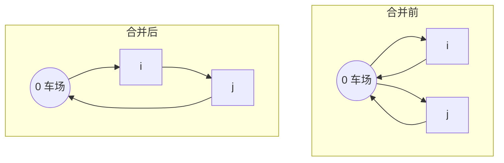

# Clarke–Wright 节约算法（Savings, CVRP 经典构造）

Clarke 与 Wright（1964）针对车辆路径问题（VRP，常见为有容量 CVRP）提出过一类构造式启发式：将原先各自独立的两条送货车线合并为一条，使总行驶距离得到「节约」。其要点是先计算客户对 (i, j) 的节约量，再按节约从大到小尝试合线。是 [基础启发式](simple-heuristics.md) 中边合并系构造的代表；与 [插入启发式](insertion-heuristics.md) 在弧上逐点插客户的步态不同。总览与分类见 [启发式算法总览](../heuristic-algorithms.md)。

---

## 一、什么是「节约」？

设车场为 0、客户为 i, j。距离记为 d(·,·)。下面先给对称路长（d(u,v)=d(v,u)）下最常见的推导；有向或不对称网时，节约定义需与开闭路、弧向约定一起写进实现与可复现说明，但「合并可省回场/绕路」的直觉一致。

### 1.1 合并前

两车分别给 i、j 送货，最简叙述为两条独立往返小回路（径向回场）：

- 车线 1：0 → i → 0，路程长为 d(0, i) + d(i, 0) = 2d(0, i)（对称时）。  
- 车线 2：0 → j → 0，路程长为 2d(0, j)（对称时）。

在合并前设定下，两条路径合起来的总路长为

\[
D_{\text{分}} = 2d(0, i) + 2d(0, j).
\]

### 1.2 合并后

改由同一条车线依次服务 i 与 j 再回场（顺序取为 0 → i → j → 0；若还允许 j 在 i 前，实现里要另作对称讨论）：

\[
D_{\text{合}} = d(0, i) + d(i, j) + d(j, 0) = d(0, i) + d(i, j) + d(0, j) \quad (\text{对称}).
\]

### 1.3 节约量

节约量定义为「合并前路程减合并后路程」（能少跑多少路）：

\[
S(i,j) = D_{\text{分}} - D_{\text{合}} = (2d(0, i) + 2d(0, j)) - (d(0, i) + d(i, j) + d(0, j)).
\]

化简后得到下列最常用的节约值公式（对称路长下与常见教材一致）：

\[
S(i,j) = d(0, i) + d(0, j) - d(i, j).
\]

**含义**：从「i 与 j 各跑一趟车场回场」改接成 i 到 j 的直连，相当于用一段 i–j 直路替代与车场相关的一段绕行。S(i, j) 越大，通常越值得优先尝试合并。  
**注**：CVRP 在合并时除节约外还须满足容量、端点、是否同路等条件，见后文；仅有正数字的节约不足以保证可合并为可行车线。

### 1.4 合并前/合并后示意（同尺度直观对照）

<figure>
<svg xmlns="http://www.w3.org/2000/svg" viewBox="0 0 900 200" width="100%" max-width="900" aria-label="C-W 合并前为两条 0 出发往返，合并后单条 0 经 i 与 j 回场">
  <text x="8" y="20" font-size="13" fill="#333">合并前：两车、两条往返</text>
  <text x="458" y="20" font-size="13" fill="#333">合并后：单车、一条 0–i–j–0</text>
  <defs>
    <marker id="aL" viewBox="0 0 10 10" refX="8" refY="5" markerWidth="7" markerHeight="7" orient="auto">
      <path d="M0,0 L10,5 L0,10 z" fill="#1976d2" />
    </marker>
  </defs>
  <g id="left" transform="translate(0, 28)">
    <circle cx="180" cy="150" r="10" fill="#1976d2" />
    <text x="174" y="155" font-size="12" fill="#fff" font-weight="600">0</text>
    <circle cx="50" cy="50" r="8" fill="#5c5c5c" />
    <text x="46" y="55" font-size="11" fill="#fff" font-weight="600">i</text>
    <circle cx="310" cy="50" r="8" fill="#5c5c5c" />
    <text x="305" y="55" font-size="11" fill="#fff" font-weight="600">j</text>
    <line x1="180" y1="140" x2="56" y2="55" stroke="#1976d2" stroke-width="2" marker-end="url(#aL)" />
    <line x1="56" y1="50" x2="174" y2="140" stroke="#1976d2" stroke-width="1.4" stroke-dasharray="4 3" />
    <line x1="180" y1="140" x2="304" y2="55" stroke="#1976d2" stroke-width="2" marker-end="url(#aL)" />
    <line x1="304" y1="50" x2="186" y2="140" stroke="#1976d2" stroke-width="1.4" stroke-dasharray="4 3" />
    <text x="85" y="100" font-size="11" fill="#555">i 径向</text>
    <text x="255" y="100" font-size="11" fill="#555">j 径向</text>
  </g>
  <line x1="450" y1="0" x2="450" y2="200" stroke="#ddd" />
  <g id="right" transform="translate(0, 28)">
    <circle cx="680" cy="150" r="10" fill="#1976d2" />
    <text x="674" y="155" font-size="12" fill="#fff" font-weight="600">0</text>
    <circle cx="500" cy="50" r="8" fill="#5c5c5c" />
    <text x="496" y="55" font-size="11" fill="#fff" font-weight="600">i</text>
    <circle cx="800" cy="50" r="8" fill="#5c5c5c" />
    <text x="795" y="55" font-size="11" fill="#fff" font-weight="600">j</text>
    <line x1="680" y1="140" x2="505" y2="55" stroke="#2e7d32" stroke-width="2.4" marker-end="url(#aL)" />
    <line x1="505" y1="50" x2="795" y2="50" stroke="#2e7d32" stroke-width="2.4" marker-end="url(#aL)" />
    <line x1="795" y1="50" x2="686" y2="140" stroke="#2e7d32" stroke-width="2.4" marker-end="url(#aL)" />
  </g>
</svg>
<figcaption style="font-size:0.9em;color:#555;margin-top:0.3em">左：0→i 与 0→j 各成往返小回路。右：合并为 0→i→j→0；虚线/多余径向在合并时被删除，i–j 段（绿）是新增直连。</figcaption>
</figure>

可选：在支持 Mermaid 的本地编辑器中，也可用下列源码渲染「合并前/后」流程关系（本站点若未接 Mermaid 插件，则作备用）。

---

## 二、并线主流程：并行 C-W（文献与实现中最常写的版本之一）

**说明**：C-W 还有「串行」等变体（合一条、重算、再合）；下框对应「并行」savings 的典型叙述：所有节约一次算好、按表从高到低试合并。其它变体以所用文献与代码为准。

::: algorithm 并行 C-W 节约法（CVRP 叙述）
### 1. 计算距离矩阵
计算车场 0 与所有客户、以及客户两两之间的距离 d(·,·)（有向时按弧定义）。

### 2. 计算节约矩阵
对所有客户对 (i, j)（i≠j，常约定 i<j 避免重复）用  
\(S(i,j) = d(0, i) + d(0, j) - d(i, j)\) 计算节约值。需求 q_i, q_j 在下一步才参与约束，不在此式内。

### 3. 节约值排序
将所有 S(i, j) 从大到小排序。节约越大，一般表示在尚未考虑容量时，先尝试合并 (i, j) 的吸引力越大。

### 4. 按序尝试合并
从最大节约的 (i, j) 起依次处理；对当前 (i, j) 在合并前同时检查（常用三条）：

- 约束：合并后该条线路总需求是否不超过单车容量上界 Q。  
- 端点/可接性：i 与 j 是否各自能作为所在路径的「可与对方拼接的一端」；典型要求二者分别处在各自链路径的外端、且能按约定与车场方向接成 0-…-i-…-j-…-0 这类结构。若任一点已夹在两个客户之间（非链端），则本对 (i, j) 不合并。  
- 独立性：i 与 j 当前若已在同一条完整路径中，则无需再对这对做合并。  

若上述均可行，则按约定把两条片段接成更长的可行车线并更新；否则弃置本对 (i, j)，继续下一对。

### 5. 扫完表
对排序后的节约表依次处理全部 (i, j) 对，或据实现设早停。输出当前路径方案（可再接局部改进等）。
:::

---

## 三、变体、性质与可复现

上节内嵌的 SVG 为页面内可读的静态图；你若有教材或课件截图，也可放入 `docs/or-opt/resources/` 并在本页以 `` 引用。可选 Mermaid 块供本地支持 Mermaid 的编辑器渲染。有向、多车场、时间窗时，节约式与端点/可接规则要按题设写清。算法不保证 CVRP 全局最优，但实现快、常与 [k-opt 系列](k-opt.md) 或元启发式搭配，或作初始上界。

**注**：TSP 与带车场、多约束的 CVRP 不划等号。车数有上界、需求异质等时，以所用文献的 λ、μ 修正或并行/串行混合版为准。  
**注（路径）**：`resources` 相对本文件 `heuristics/simple/clarke-wright-savings.md` 为 `../../resources/`；若你习惯把图放在与 `or-opt` 同级的别目录，请改链接。
